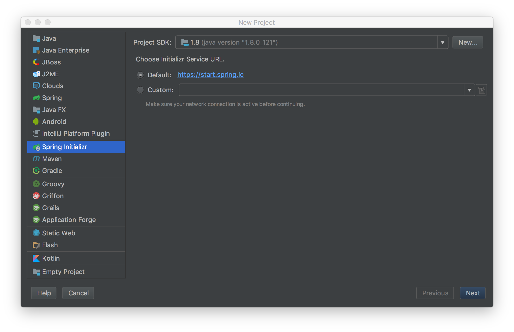
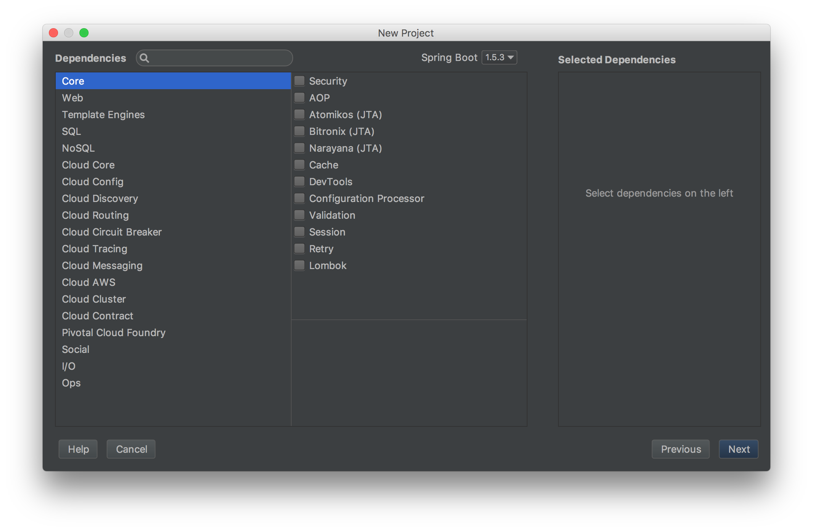

## SpringBoot 초기화

* IntelliJ의 Spring Initializr 사용
    1. File > New > Project > Spring Initializr 선택
    
    2. Group, Artifact, Name 등등 입력. Maven 또는 Gradle 선택 (여기서는 Gradle 기준으로 설명)
    3. 적절하게 의존성을 선택합니다. (Web, JPA, Template Engines 등등)
    
* SpringBoot CLI 사용
    `-d` 옵션을 사용해서 의존성을 지정한다.
    ```
    spring init -d=web,thymeleaf,data-jpa,h2 --groupId=io.github.gaemi --artifactId=sample --name="Sample" --package-name=sample --description="Sample Application" --build gradle sample
    ```

## SpringBoot Application 실행방법

* Application Class 의 메인함수 실행하기
    ```java
    @SpringBootApplication
    public class SampleApplication {
    	public static void main(String[] args) { // Run!!
    		SpringApplication.run(SampleApplication.class, args);
    	}
    }
    ```
* gradle의 bootRun 사용
    ```
    gradlew bootRun
    ```
* jar 실행
    ```
    gradlew build
    java -jar build/libs/sample-0.0.1.SNAPSHOT.jar
    ```
